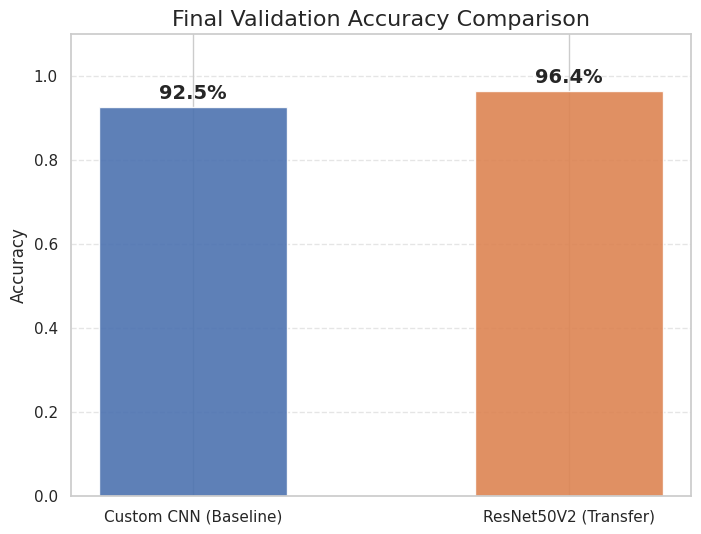
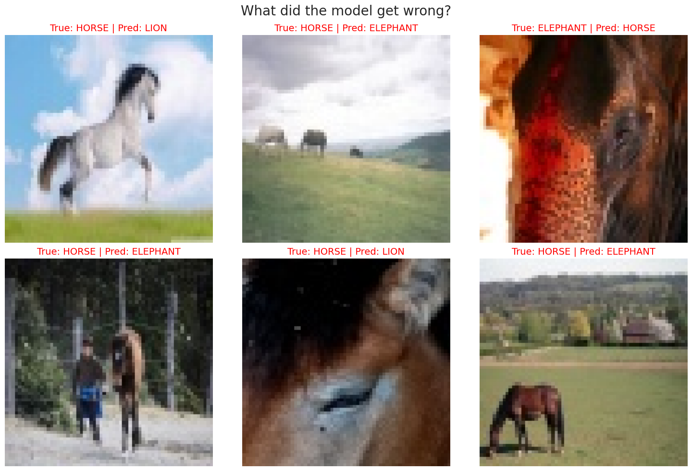

# 🦁 Multi-Class Mammal Image Classification

**A Deep Learning approach to wildlife monitoring using Custom CNNs and Transfer Learning (ResNet50V2).**

##  Overview
Biodiversity is declining quickly, and conservation depends on reliable information about where species occur. Camera traps can collect millions of images, but the sheer volume often leads to "data overload". Manually identifying species in these large datasets is not practical.

This project aims to reduce this bottleneck by creating a practical Computer Vision tool for conservationists. We classify 5 distinct mammal species: **Elephant, Lion, Horse, Dog, and Cat**.

##  Objectives
* **Baseline Development:** Build a lightweight Custom CNN from scratch to establish a performance benchmark.
* **Transfer Learning:** Implement **ResNet50V2** to assess the benefits of using pre-learned features.
* **Robustness Analysis:** "Stress test" the models using dynamic data augmentation (rotations, flips, zooms).
* **Error Analysis:** Visualize failure cases to understand model limitations.

##  Methodology
### Data Preprocessing
* **Source:** "Animal-5-Mammal" Dataset.
* **Resizing:** All images resized to `224x224` pixels.
* **Normalization:** Pixel values scaled to `[0, 1]` for faster convergence.

### Models
1.  **Custom CNN:** A 4-block architecture with Batch Normalization and Dropout to prevent overfitting.
2.  **ResNet50V2:** A state-of-the-art model pre-trained on ImageNet, fine-tuned with custom dense layers.

##  Results
We compared both models on accuracy, precision, recall, and F1-score.

| Model | Accuracy | Precision | Recall | F1-Score |
| :--- | :---: | :---: | :---: | :---: |
| **Custom CNN** | 92.55% | 0.93 | 0.92 | 0.92 |
| **ResNet50V2** | **96.40%** | **0.96** | **0.96** | **0.96** |

**Key Finding:** While the custom model performed surprisingly well (92.55%), Transfer Learning provided the reliability needed for real-world deployment (96.40%).

### Learning Curves

*Comparison of Validation Accuracy between Custom CNN and ResNet50V2.*

##  Error Analysis
Despite high accuracy, the model struggled in specific edge cases.
* **Context Confusion:** Horses in grassy fields were sometimes mistaken for Lions or Elephants due to the background similarity.
* **Texture Ambiguity:** Close-up shots of fur/skin caused confusion without the full body silhouette.



##  Tech Stack
* **Language:** Python 3.x
* **Libraries:** TensorFlow/Keras, NumPy, Pandas, Matplotlib, Scikit-learn
* **Tools:** Jupyter Notebook, LaTeX (for reporting)

##  How to Run
1.  **Clone the repository:**
    ```bash
    git clone [https://github.com/AnahitaNouri/Mammal-Multi-Classification.git](https://github.com/AnahitaNouri/Mammal-Multi-Classification.git)
    ```
2.  **Install dependencies:**
    ```bash
    pip install tensorflow pandas matplotlib scikit-learn
    ```
3.  **Run the notebook:**
    Open `notebooks/main.ipynb` in Jupyter.

##  Report
The full academic report explaining the theoretical background and detailed experiments can be found in the `report/` folder: [Mammal_Classification.pdf](report/Mammal_Classification.pdf).

---
**Author:** Anahita Nouri
**Student ID:** VR509464
**University of Verona**